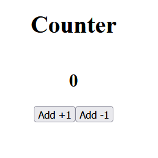

- Baue einen Counter in React
- nutze `state`
- Die App soll zwei Buttons haben
- ein `+` Button zum hochzählen
- ein `-` Buztton zum runterzählen

### Bonus

- der `count` soll nicht unter 0 gehen

### Beispiel-Code aus der Session

https://github.com/mpagels/bo-java-23-2-react-counter-example/blob/main/src/App.tsx

### Bonus 2
- Falls nicht schon getan, lagert euren Code in eine  `<Counter />` Komponenten aus
- übergebt ein prop `initialValue` der Counter Komponente, die den Counter nicht mehr mit 0, sondern mit z.B. 5 als initial Wert startet

### Bonus Die Hart Mode
- übergebt der Counter Komponenten auch noch ein `toAdd` value, wie viel der Counter hochzählen soll
- (aktuell zählt er hardcoded einfach plus 1 hoch oder runter
- dieser Wert soll per Prop eingebaut werden ;-) 
